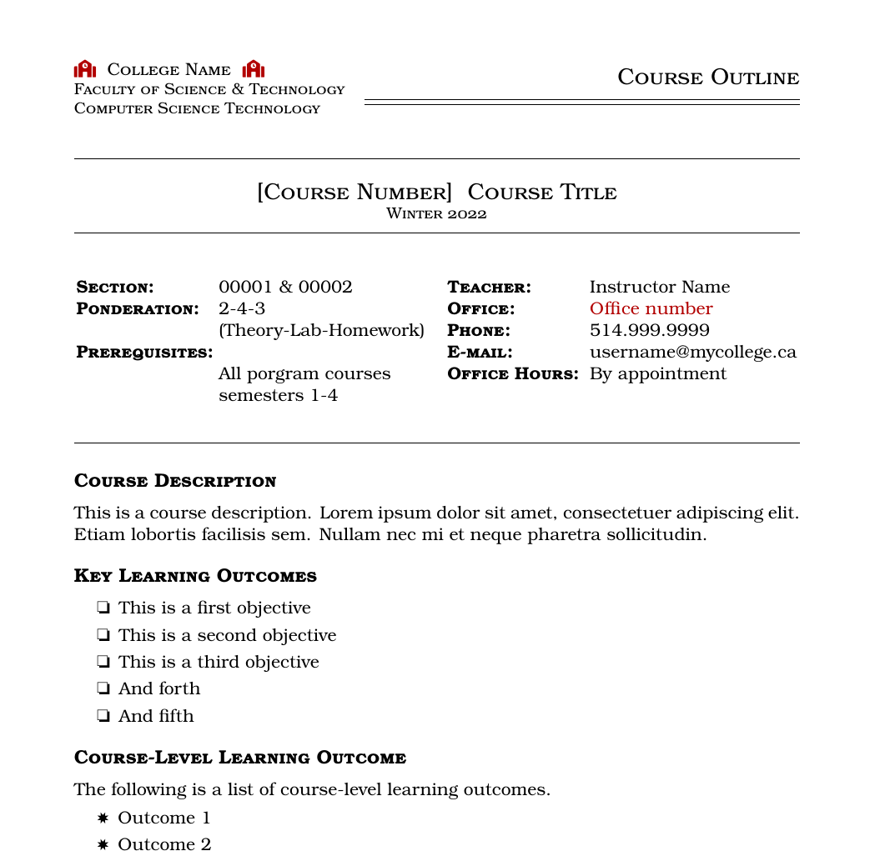
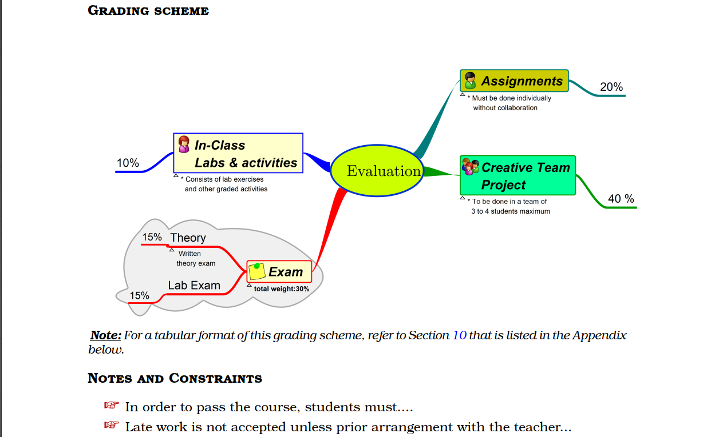

# LaTeX Course Outline Template
A simple, modular and clean LaTeX template for developing course outline/syllabus. 
It features Font Awesome, dingbat lists as well as a mindmap that illustrates a grading scheme.

## Working Examples
* [Course outline example](examples/Course-Outline-Sample.pdf)

## Main Features
- Mind map-based grading scheme (which was created using Freeplane)
- Clean textbook listing.
- Font Awesome icons.
- Custom dingbat lists.
- Course schedule table.

# Instructions
Modify your instructor and course info 

```
course-info.tex
```
and 
```
teacher-info.tex
```
respectively.

## Screenshots
The layout of the document header.
  ​

**Grading scheme**
  ​

